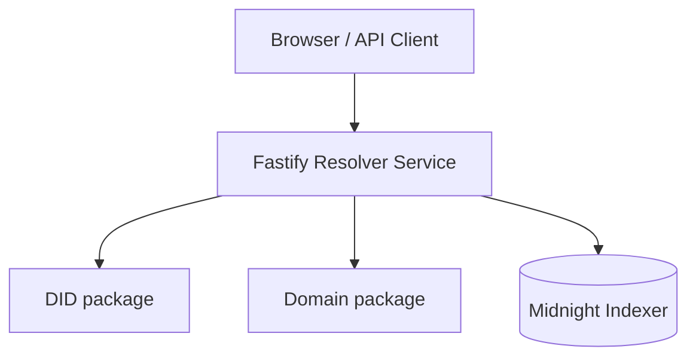
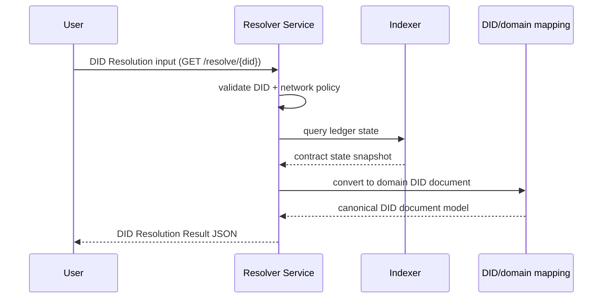
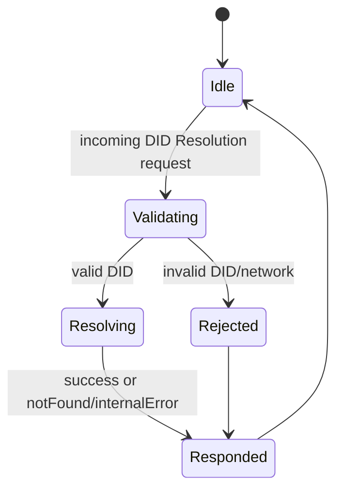

# @midnight-ntwrk/midnight-did-resolver-service

Standalone DID resolver service with REST API, Swagger UI, and a minimal web UI.

## Use It When

- you need DID Resolution Result responses over HTTP
- you want a browser-accessible resolver for manual inspection
- you want a service boundary separate from DID mutation workflows in the manager

## Responsibilities

- Resolve `did:midnight` into DID Resolution Results
- Return DID Resolution Results as defined by DID Core:
  - `didDocument`
  - `didResolutionMetadata`
  - `didDocumentMetadata`
- Expose HTTP endpoints for resolution and health checks
- Support runtime-configurable indexer endpoints

## Architecture

## DID Resolution Sequence

## Service State (request lifecycle)

## Endpoints

- `GET /health`
- `GET /ready`
- `GET /resolve/:did` (DID Resolution)
- `POST /resolve` with `{ "did": "did:midnight:..." }` (DID Resolution)
- `GET /docs` (Swagger UI, optional)
- `GET /` (simple HTML UI)

## Configuration

- `RESOLVER_HOST` (default `127.0.0.1`)
- `RESOLVER_PORT` (default `3001`)
- `MIDNIGHT_INDEXER_HTTP_URL`
- `MIDNIGHT_INDEXER_WS_URL`
- `MIDNIGHT_NETWORK` (`undeployed|devnet|testnet|mainnet|preview|preprod`)
- `RESOLVER_DEBUG=true` (optional verbose errors)
- `RESOLVER_ENABLE_DOCS=true|false` (default `true`)
- `RESOLVER_TIMEOUT_MS` (default `15000`)

## Runtime Profiles

- standalone via `./start-resolver.sh`
- preprod via `./start-resolver.sh --preprod`
- mainnet via `./start-resolver.sh --mainnet`
  - defaults:
    - `MIDNIGHT_INDEXER_HTTP_URL=https://indexer.mainnet.midnight.network/api/v4/graphql`
    - `MIDNIGHT_INDEXER_WS_URL=wss://indexer.mainnet.midnight.network/api/v4/graphql/ws`
  - defaults are overridable via env vars

## Production Defaults

- Request hardening:
  - body limit: `64KB`
  - request timeout: `15s`
  - connection timeout: `10s`
  - keep-alive timeout: `5s`
  - max param length: `1024`
- Response security headers:
  - `X-Content-Type-Options: nosniff`
  - `X-Frame-Options: DENY`
  - `Referrer-Policy: no-referrer`
  - `Cross-Origin-Resource-Policy: same-origin`
- Graceful shutdown:
  - handles `SIGINT` and `SIGTERM`
  - closes Fastify app before exit

## Run

- Build: `pnpm --filter @midnight-ntwrk/midnight-did-resolver-service build`
- Dev: `pnpm --filter @midnight-ntwrk/midnight-did-resolver-service dev`
- Start: `pnpm --filter @midnight-ntwrk/midnight-did-resolver-service start`
- Unit tests: `pnpm --filter @midnight-ntwrk/midnight-did-resolver-service test`
- Integration tests: `pnpm --filter @midnight-ntwrk/midnight-did-resolver-service test:integration`

Default local URL:
- `http://127.0.0.1:3001`

## Docker Integration Tests

Integration tests use compose + Testcontainers and now enforce cleanup via:
- `env.down({ removeVolumes: true })`
- fallback `docker compose down --volumes --remove-orphans`

This reduces dangling containers/volumes after failures.
