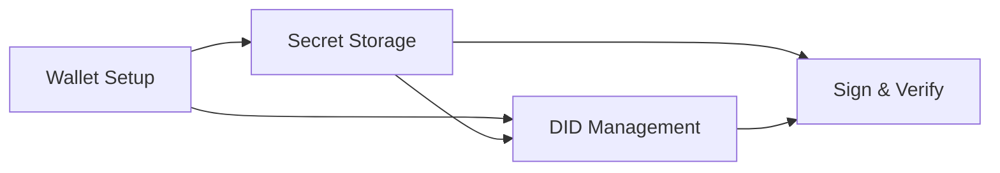
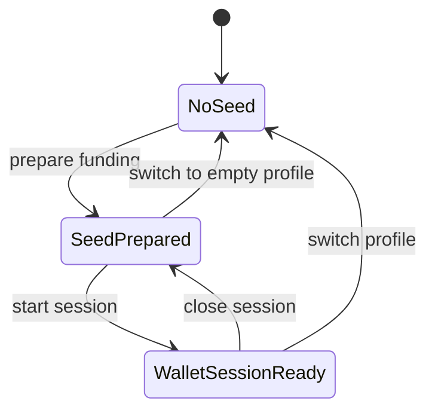
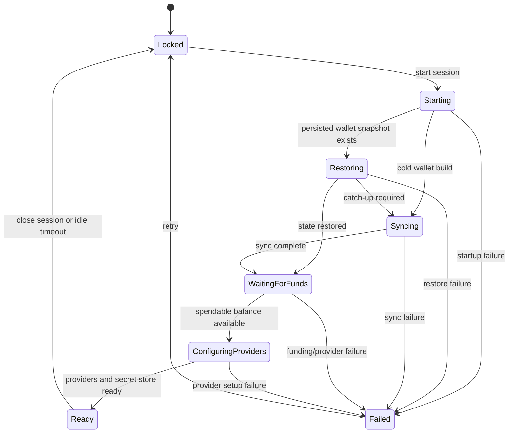
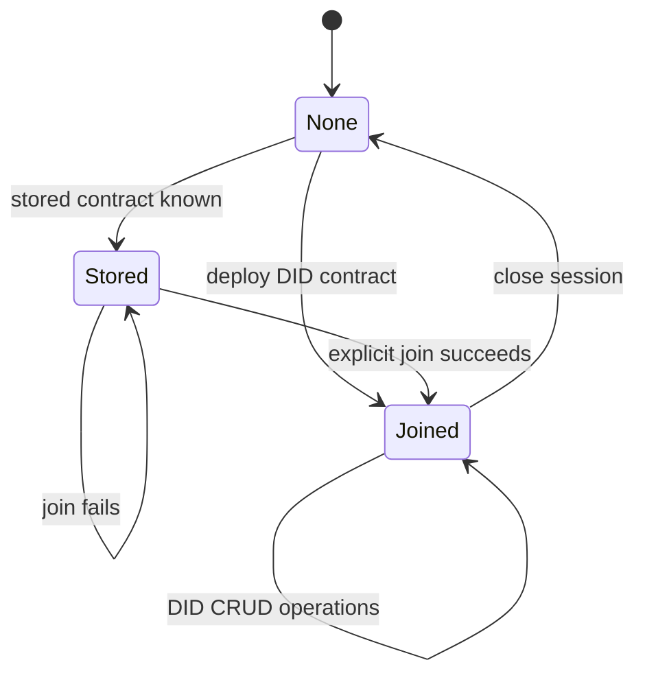
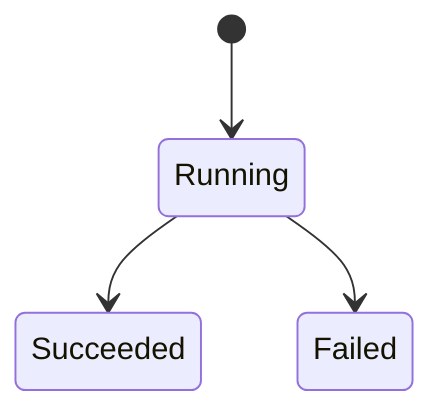
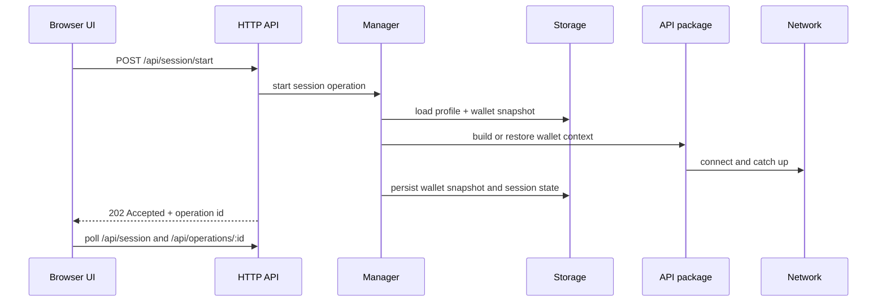
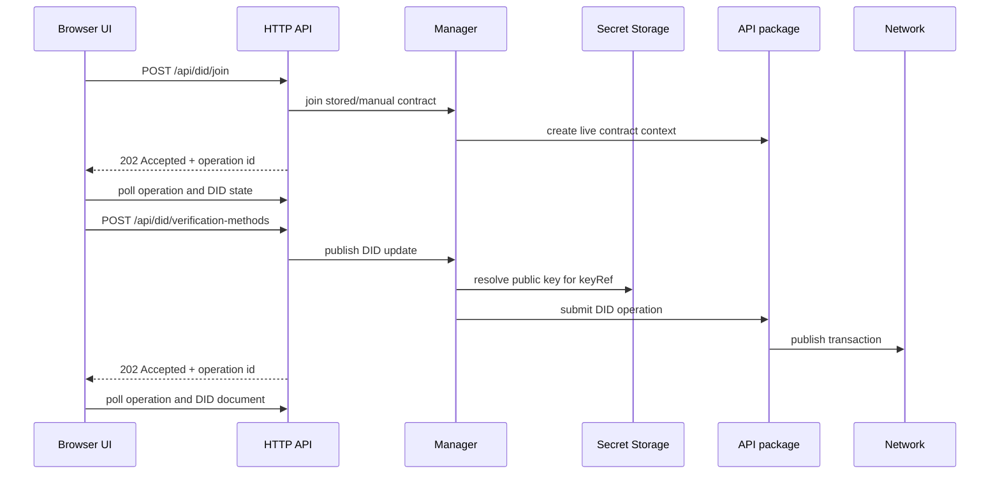

# DID Manager Architecture

The DID Manager is a single-user operational service for managing Midnight wallet state, local secret storage, detached payload proofs, and Midnight DID contract interactions through one backend and four UI workspaces:

- `Wallet Setup`
- `Secret Storage`
- `Sign & Verify`
- `DID Management`

This page describes the current architecture as an intentional model, not as a migration story.

## Design Goals

The manager is designed around these constraints:

1. the backend owns the active network setup
2. the user can keep multiple local profiles per setup
3. the same seed anchors wallet continuity and DID continuity
4. wallet/session readiness is different from DID contract readiness
5. long-running actions are asynchronous and observable
6. remote-network state can be reused safely between runs

## Runtime Boundaries

At runtime, the manager coordinates four layers:

```mermaid
graph TD
  UI[Browser UI]
  HTTP[did-manager-service HTTP layer]
  Manager[Manager orchestration]
  Secrets[secret-storage]
  API[@midnight-ntwrk/midnight-did-api]
  Chain[Node / Indexer / Proof Server]
  Storage[Profile state + wallet snapshots + private state DB]

  UI --> HTTP
  HTTP --> Manager
  Manager --> Secrets
  Manager --> API
  Manager --> Storage
  API --> Chain
```

### Responsibilities

| Layer | Responsibility |
| --- | --- |
| Browser UI | page layout, polling, task feedback, operator workflow |
| HTTP layer | route contracts, async operation resources, validation |
| Manager orchestration | profile selection, runtime session state, DID workflow coordination |
| `secret-storage` | local key generation, import, deletion, public-key lookup |
| `api` package | wallet construction, chain interaction, contract operations |
| Local storage | profile files, wallet snapshots, private contract state |

## Top-Level User Model

The UI is intentionally split into three concerns:



### Wallet Setup

Owns:

- profile selection
- seed preparation and reuse
- funding address preparation
- wallet session start and close
- wallet balance visibility for NIGHT / tNIGHT and DUST
- connection/session visibility

### Secret Storage

Owns:

- local key generation
- key import
- key deletion
- local key inventory

### Sign & Verify

Owns:

- payload normalization by type
- detached signing with DID-associated local keys
- detached verification by local key, direct public JWK, or DID-resolved verification method
- cross-profile verification where the public key is resolved from the DID document

### DID Management

Owns:

- DID contract deployment
- DID contract join
- verification method publishing
- relation management
- service management
- alias management
- DID document visibility

This split keeps local custody concerns separate from on-chain DID concerns.

## State Machines

The service is built around three independent but coordinated loops.

## 1. Profile and Seed Loop

This loop controls which local profile is active and whether a shared seed has been prepared.



| State | Meaning |
| --- | --- |
| `NoSeed` | The active profile has no stored seed. |
| `SeedPrepared` | The shared seed and derived funding address are stored. |
| `WalletSessionReady` | The wallet session is usable for DID operations. |

### Invariants

- one active local profile per backend setup
- one shared seed for wallet derivation and DID continuity
- profile state is isolated by setup and profile name

## 2. Wallet Session and Connectivity Loop

This loop models the lifecycle of wallet readiness.



| State | Meaning |
| --- | --- |
| `Locked` | No active runtime session exists. |
| `Starting` | Start Session has been accepted and seed/profile resolution is in progress. |
| `Restoring` | Persisted wallet state is being restored. |
| `Syncing` | The wallet is catching up with network state. |
| `WaitingForFunds` | The wallet is synchronized but not yet considered spendable. |
| `ConfiguringProviders` | Provider and secret-store bindings are being prepared. |
| `Ready` | The wallet session can be used for DID operations. |
| `Failed` | Session establishment failed. |

### Why this loop is separate

Wallet readiness is a network/runtime concern. It is not the same as:

- having a stored contract address
- joining a DID contract
- publishing DID updates

Treating it as a distinct loop keeps session recovery and DID recovery independent.

## 3. DID Lifecycle Loop

This loop controls DID contract selection and DID mutation availability.



| State | Meaning |
| --- | --- |
| `None` | No active DID contract is selected for the current session. |
| `Stored` | A contract address is known for the profile, but no live contract instance is joined. |
| `Joined` | The DID contract is joined and DID operations are available. |

### Design rule

Starting a wallet session does not implicitly join a stored contract.

That keeps:

- wallet readiness explicit
- stale contract failures isolated
- DID contract choice observable in the UI

## Async Operations

All mutating backend calls are represented as operation resources.



### Contract

| Endpoint pattern | Behavior |
| --- | --- |
| `POST`, `PUT`, `DELETE` mutating endpoints | return `202 Accepted` with operation id |
| `GET /api/operations/current` | inspect the current running operation |
| `GET /api/operations/:id` | poll a specific operation |
| `GET /api/operations` | recent operation history |

### Why this matters

This lets the service represent:

- wallet startup
- proof generation
- submission
- indexer catch-up

without blocking the browser request that started the action.

## Persistence Model

Persistence is scoped by:

- backend setup
- local profile
- seed hash

### Profile state

Stored under:

```text
~/.midnight-did/profiles/<network>/<profile>/
```

Contains:

- manager session state
- manager secrets
- wallet snapshots
- Midnight private-state storage

### Wallet snapshots

For reusable networks such as `preprod`, wallet snapshots are stored under:

```text
~/.midnight-did/profiles/<network>/<profile>/wallet-state/<seedHash6>/
```

This allows the service to restore wallet state for the same `(network, profile, seed)` tuple between runs.

### Private contract state

Private contract state is stored separately:

```text
~/.midnight-did/profiles/<network>/<profile>/midnight-level-db/<seedHash16>/
```

That separation avoids collisions between:

- wallet sync snapshots
- contract-private state

### Standalone vs preprod

| Setup | Persistence strategy |
| --- | --- |
| `standalone` | ephemeral wallet behavior is acceptable |
| `preprod` | wallet snapshots are reused between runs |

## Request and Data Flows

## Start Session Flow



## DID Join and Update Flow



## UI Synchronization Model

The browser is intentionally polling-based.

Primary endpoints:

- `/api/session`
- `/api/operations/current`
- `/api/operations`
- `/api/contracts`
- `/api/did/state`
- `/api/did/document`
- `/api/keys`

### Why polling is sufficient here

The manager is:

- single-user
- local or operator-driven
- stateful but not high-throughput

That makes polling a reasonable architectural choice:

- simpler than a push transport
- easier to debug
- good enough for current latency and interaction patterns

## Network Configuration Model

The backend, not the browser, chooses the active setup.

Supported modes:

- `standalone`
- `preprod`

The UI can switch local profiles within that setup, but it cannot mutate the setup itself.

This avoids invalid states such as:

- browser selecting `preprod` against a standalone backend
- profile state crossing setup boundaries

## Why the Architecture Is Split This Way

The manager has three distinct responsibilities:

1. prepare and maintain a usable wallet session
2. maintain local secret storage for keys
3. manage a DID contract and DID document lifecycle

Keeping those concerns separate at the page, state-machine, and storage level makes the service easier to reason about and easier to operate.

## Related Documents

- [Services: DID Manager Service](/services/did-manager-service)
- [ADR: Shared Seed and Local Profiles](/architecture/adr-shared-seed-and-profiles)
- [ADR: Resolver vs Manager Service Split](/architecture/adr-service-split)
- [Source: Manager README](/source/did-manager-service-readme)
