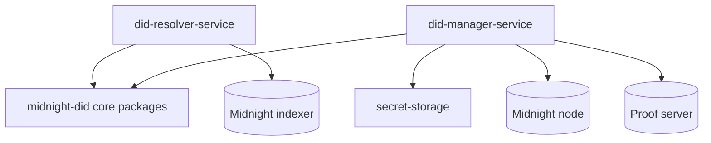

# Architecture

The resolver repository owns service-side identity runtime concerns that sit above the core DID method packages.

Use these architecture pages when changing boundaries between resolver, manager, and local key custody.

## Decisions

- [ADR: Resolver vs Manager Service Split](/architecture/adr-service-split)
- [ADR: Shared Seed and Local Profiles](/architecture/adr-shared-seed-and-profiles)
- [ADR: HD Key Derivation and Ledger Compatibility](/architecture/adr-hd-key-derivation-and-ledger-compatibility)
- [ADR: Service Runtime Hardening](/architecture/adr-service-runtime-hardening)
