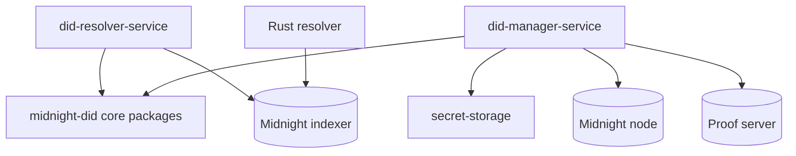

# Architecture

The resolver repository owns service-side identity runtime concerns that sit above the core DID method packages.

Use these architecture pages when changing boundaries between resolver, manager, and local key custody.
