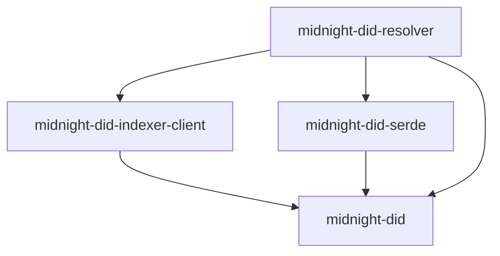
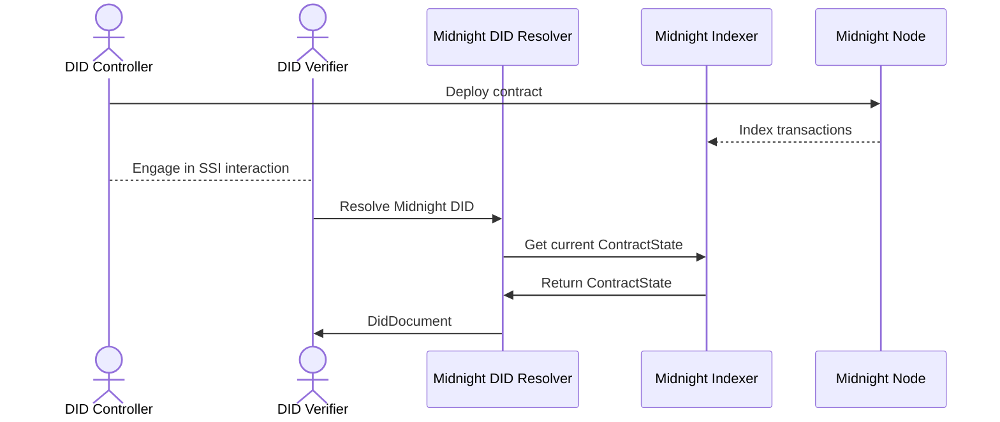

# Midnight DID Resolver Design

## Project Structure

The Midnight DID Resolver project is organized as a multi-crate cargo workspace.

### Crate Overview

- **midnight-did**  
  Core library for Decentralized Identifier (DID) logic, including contract state management, resolution algorithms, and error handling.

- **midnight-did-indexer-client**  
  GraphQL client for querying the Midnight Indexer, used to fetch contract state and DID-related data for resolution.

- **midnight-did-serde**  
  Serialization and deserialization utilities for DID documents and contracts.
  This crate implements native Rust deserialization, porting logic from the `compact-runtime`.
  The implementation supports versioned compact runtime formats (e.g., `compact_v0_9`) and provides the `DefaultContractStateDeserializer` for production use.

- **midnight-did-resolver**  
  Main resolver application and CLI, orchestrating DID resolution by integrating core logic, indexer queries, and native Rust serialization.

### Crate Dependency Diagram

### Additional Build Artifacts

- **midnight-did-js** (Nix package)  
  A separate JavaScript/TypeScript package available via Nix build (`.#midnight-did-js`), containing DID serialization utilities compiled from the Midnight compact contract. This package is independent of the main Rust resolver and can be used for JavaScript-based integrations.

## Resolution Flow

### Step-by-Step Explanation
1. **Contract Deployment**: The DID Controller deploys a DID contract to the Midnight Node.
2. **Transaction Indexing**: The Midnight Indexer syncs and indexes the contract state for queries.
3. **SSI Interaction**: The Controller and Verifier interact for identity operations (e.g., authentication, credential exchange).
4. **DID Resolution Request**: The Verifier requests DID resolution from the Midnight DID Resolver.
5. **Contract State Query**: The Resolver asks the Indexer for the latest DID contract state.
6. **State Retrieval**: The Indexer returns the current contract state to the Resolver.
7. **DID Document Delivery**: The Resolver deserializes the contract state using native Rust deserialization, validates and formats the DID Document, then sends it to the Verifier.
