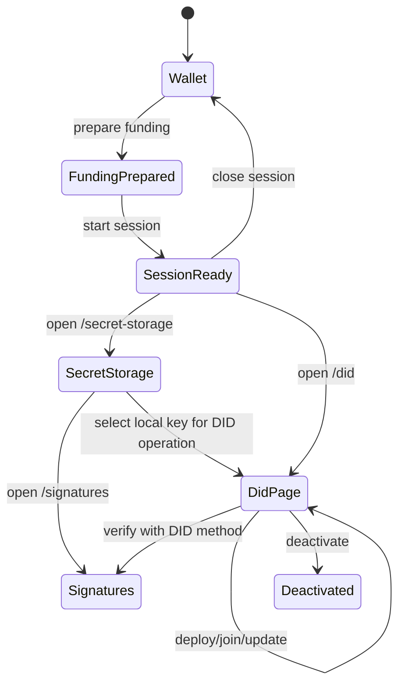

# DID Manager Service

The DID manager is a single-user Node.js web application for wallet preparation and Midnight DID lifecycle operations.

## Scope

- prepare funding using the same shared seed used for DID ownership
- start sessions and persist local profiles
- explicitly close wallet/runtime sessions to release resources before profile or flow changes
- expose current NIGHT / tNIGHT and DUST balances for the active wallet session
- manage local secret storage independently from DID publication
- sign and verify detached payloads against Midnight DID verification methods
- deploy or join a DID contract
- manage verification methods, relations, services, aliases, and deactivation

## Main pages

- `/wallet`
- `/secret-storage`
- `/signatures`
- `/did`
- `/docs`

Detailed workspace docs:

- [Wallet Setup workspace](/services/wallet-setup)
- [Secret Storage workspace](/services/secret-storage-workspace)
- [Sign & Verify workspace](/services/sign-verify-workspace)
- [DID Management workspace](/services/did-management-workspace)
- [Getting started guide](/guide/getting-started-did-manager)

## User flow



## Main configuration

| Variable | Purpose |
|---|---|
| `DID_MANAGER_SETUP` | Runtime setup: `standalone`, `preprod`, or `mainnet` |
| `DID_MANAGER_HOST` | Bind host |
| `DID_MANAGER_PORT` | Bind port |
| `DID_MANAGER_DATA_DIR` | Persistent local data directory |
| `DID_MANAGER_SESSION_FILE` | Optional explicit session file path |
| `DID_MANAGER_SECRET_FILE` | Optional explicit secret store file path |
| `DID_MANAGER_SECRET_PASSPHRASE` | Secret store passphrase; required for `preprod` and `mainnet` |
| `DID_MANAGER_LOG_FILE` | Log output file |

## Run

```bash
npm run dev -w @midnight-ntwrk/midnight-did-manager-service
./start-manager.sh
./start-manager.sh --preprod
./start-manager.sh --mainnet
```

`--preprod` and `--mainnet` default to public `/api/v4/graphql` indexers.
`--mainnet` defaults to local proof server (`http://127.0.0.1:6300`) and has no faucet; operators should use the funded Midnight Wallet seed.

## Main repository paths

- `did-manager-service/src/index.ts`
- `did-manager-service/src/app.ts`
- `did-manager-service/src/manager.ts`
- `did-manager-service/src/manager/`
- `did-manager-service/src/http/`
- `did-manager-service/src/ui/`
- `did-manager-service/README.md`

## Runtime hardening

Mutating API routes run through a single-flight operation store. Runtime wallet/session state is serialized inside `ManagerRuntimeState`, and unlock startup is generation-guarded so stale wallet contexts cannot attach after a newer lock or unlock begins.

DID-based detached verification also checks that the requested verification method is bound to the DID returned by the resolver before checking the signature. `preprod` and `mainnet` manager profiles require `DID_MANAGER_SECRET_PASSPHRASE`; only standalone mode uses the development fallback.

## Architecture

- [DID Manager Architecture](/architecture/did-manager-service)
- [ADR: Shared Seed and Local Profiles](/architecture/adr-shared-seed-and-profiles)
- [ADR: Resolver vs Manager Service Split](/architecture/adr-service-split)
- [ADR: Service Runtime Hardening](/architecture/adr-service-runtime-hardening)

## Full source doc

- [Embedded Manager README](/source/did-manager-service-readme)
