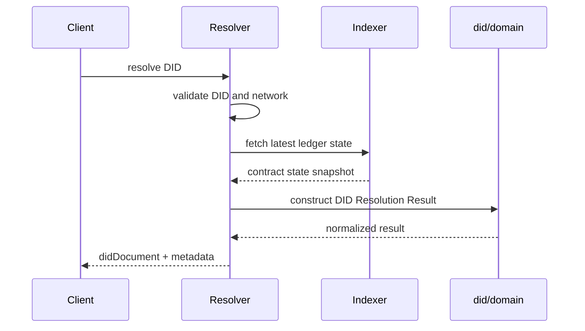

# DID Resolver Service

The DID resolver is a standalone Node.js service that resolves Midnight DIDs through the indexer-backed SDK flow and exposes both a REST API and a browser UI.

## Scope

- resolve DID documents and resolution metadata
- support standalone, preprod, and mainnet runtime profiles
- provide a simple UI for manual resolution checks

Quick start:

- [DID Resolver Getting Started](/guide/getting-started-did-resolver)

## Main endpoints

- `GET /health`
- `GET /ready`
- `GET /resolve/:did`
- `POST /resolve`
- `GET /docs`

## Runtime flow



## Main configuration

| Variable | Purpose |
|---|---|
| `RESOLVER_HOST` | Bind host |
| `RESOLVER_PORT` | Bind port |
| `MIDNIGHT_NETWORK` | Target network profile |
| `MIDNIGHT_INDEXER_HTTP_URL` | Indexer HTTP endpoint |
| `MIDNIGHT_INDEXER_WS_URL` | Indexer WS endpoint |
| `RESOLVER_ENABLE_DOCS` | Enable Swagger UI |
| `RESOLVER_TIMEOUT_MS` | Request timeout |

## Run

```bash
npm run dev -w @midnight-ntwrk/midnight-did-resolver-service
./start-resolver.sh --preprod
./start-resolver.sh --mainnet
```

`--mainnet` now uses default endpoints:
- `https://indexer.mainnet.midnight.network/api/v4/graphql`
- `wss://indexer.mainnet.midnight.network/api/v4/graphql/ws`

You can override both with `MIDNIGHT_INDEXER_HTTP_URL` and `MIDNIGHT_INDEXER_WS_URL`.

## Endpoint policy

Indexer HTTP and WebSocket endpoints are immutable startup configuration. Set
`MIDNIGHT_INDEXER_HTTP_URL` and `MIDNIGHT_INDEXER_WS_URL` before starting the
service; request-level endpoint overrides are rejected. This keeps the
resolver's outbound network boundary operator-controlled and prevents callers
from turning it into an SSRF proxy. Configured defaults may still point at
local standalone infrastructure.

## Container runtime

The runtime Docker image switches to the bundled `node` user before starting the resolver process. Dependency install and artifact copy remain build/setup steps; the deployed service process does not run as root.

## Main repository paths

- `did-resolver-service/src/index.ts`
- `did-resolver-service/src/app.ts`
- `did-resolver-service/src/service.ts`
- `did-resolver-service/README.md`

## Full source doc

- [Embedded Resolver README](/source/did-resolver-service-readme)


## Architecture

- [ADR: Service Runtime Hardening](/architecture/adr-service-runtime-hardening)
