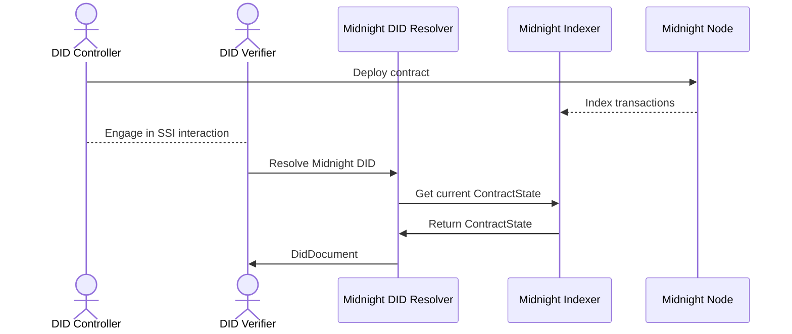

# Midnight DID Resolver Architecture

## Resolution Flow

### Step-by-Step Explanation
1. **Contract Deployment**: The DID Controller deploys a DID contract to the Midnight Node.
2. **Transaction Indexing**: The Midnight Indexer syncs and indexes the contract state for queries.
3. **SSI Interaction**: The Controller and Verifier interact for identity operations (e.g., authentication, credential exchange).
4. **DID Resolution Request**: The Verifier requests DID resolution from the Midnight DID Resolver.
5. **Contract State Query**: The Resolver asks the Indexer for the latest DID contract state.
6. **State Retrieval**: The Indexer returns the current contract state to the Resolver.
7. **DID Document Delivery**: The Resolver validates and formats the DID Document, then sends it to the Verifier.
