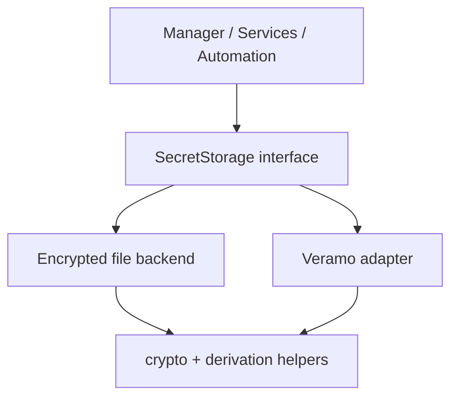
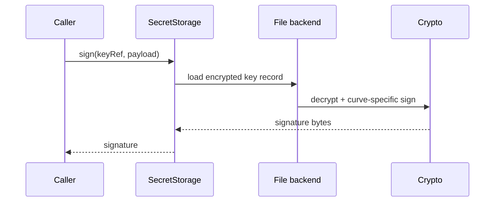
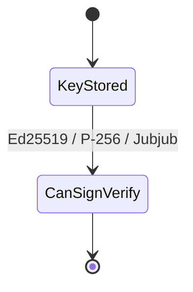

# @midnight-ntwrk/midnight-did-secret-storage

Reusable encrypted secret storage for Midnight DID key lifecycle operations.

## Quick Adoption

| Aspect | Value | Notes |
|---|---|---|
| Package | `@midnight-ntwrk/midnight-did-secret-storage` | Reusable library package |
| Runtime target | Node.js 24+ | Uses Node crypto APIs and filesystem-backed storage |
| Primary use case | Local key custody for Midnight DID flows | DID manager service, web backends, automation, test harnesses |
| Storage model | Encrypted file backend or adapter-backed backend | File backend is the default implementation |
| Key reference model | `keyRef` first | Callers keep opaque key references instead of raw secret material |
| Output format | Public JWK + raw signature bytes | Fits the rest of the Midnight DID stack |
| Supported curves | `Ed25519`, `Jubjub`, `P-256` | All supported for generation/import/derivation; sign/verify supported in the file backend |

## Generic Interfaces

### Core types

| Type | Purpose | Important fields |
|---|---|---|
| `Seed` | Canonical validated seed value | 64 lowercase hex chars / 32 bytes |
| `PublicJwk` | Public key exchange format | `kty`, `crv`, `x`, optional `y` |
| `StoredKeyMeta` | Stable metadata returned from the store | `id`, `keyRef`, `did`, `purpose`, timestamps, algorithm |
| `GenerateKeyInput` | Generate a fresh key | `id`, `kty`, `crv`, optional `did`, `purpose` |
| `ImportKeyInput` | Import an existing private key | `privateKey`, `kty`, `crv`, optional `did`, `purpose` |
| `DeriveKeyFromSeedInput` | Deterministically derive a key from a seed | `seedHex`, `kty`, `crv`, optional `account`, `index` |
| `VerifyInput` | Signature verification input | `payload`, `signature`, plus `keyRef` or `publicJwk` |
| `SignOutput` | Signature result | `signature`, `format="raw"` |

### Main interface

| Interface | Purpose | Methods |
|---|---|---|
| `SecretStorage` | Generic secret-storage abstraction | `initialize`, `listKeys`, `generateKey`, `importKey`, `deriveKeyFromSeed`, `getPublicKey`, `sign`, `verify`, `deleteKey` |

### Default implementation

| Implementation | Target platform | Notes |
|---|---|---|
| `FileSecretStore` | Node.js local backend | Encrypted JSON envelope on disk, suitable for local/dev/service-side custody |
| `VeramoSecretStore` | Adapter integration | Exposes the same `SecretStorage` shape over a Veramo agent |

## Midnight Libraries Used

| Library | Used for | Why it matters |
|---|---|---|
| `@midnight-ntwrk/wallet-sdk-hd` | Seed-to-HD derivation | Provides Midnight-compatible account/role/index key derivation primitives |
| `@midnight-ntwrk/ledger-v8` | Jubjub math and field constraints | Used for Jubjub-compatible signing/verification and ledger representability checks |

## External Libraries Used

| Library | Used for | Target/runtime aspect |
|---|---|---|
| `zod` | Seed schema and runtime validation | Keeps package boundaries explicit and safe for callers |
| `circomlibjs` | Jubjub-compatible cryptographic support | Supports Midnight-compatible Jubjub operations in TS |
| Node `crypto` | HKDF, AES-GCM, scrypt, Ed25519/P-256 primitives | Core cryptographic runtime on Node.js |
| Node `fs/promises` | Encrypted file persistence | File backend implementation detail |

## Responsibilities

- Generate/import/list/delete keys
- Derive keys from seed (HD-style derivation)
- Sign and verify payloads
- Keep private key material encrypted at rest

## File Backend Security Properties

- Creates private store files with owner-only `0600` permissions.
- Persists updates with an `fsync` + atomic rename flow to avoid partial writes.
- Uses passphrases only to derive the in-memory encryption key; the passphrase itself is not retained.

## Architecture



## Signing Flow



## Key/Curve Capability State



## Supported Curves

- Ed25519
- P-256
- Jubjub

Jubjub signing/verification is aligned with contract-compatible verification paths used in this repository.

## Adoption Notes

| Topic | Guidance |
|---|---|
| Best integration point | Depend on the `SecretStorage` interface, not directly on `FileSecretStore` unless you specifically want local file custody |
| Backend/frontend boundary | Keep this package on the Node.js side when secrets must not leave the server |
| Secret handling | Persist `keyRef`; avoid passing raw private key bytes outside import/derivation boundaries |
| DID integration | Bind `StoredKeyMeta.did` and `purpose` only as metadata; the cryptographic key remains reusable |
| Ledger compatibility | Not every mathematically valid key is Compact-field compatible; this package explicitly checks that |
| Publishing readiness | Public entry points are re-exported from `src/index.ts`; use those rather than deep imports |

## HD Derivation

### Seed format

- input seed type: `Seed`
- encoding: lowercase hex
- exact length: `64` hex characters
- entropy size: `32` bytes

The package enforces this through `SeedSchema` and `parseSeed(...)`.

### Derivation model

HD derivation is intentionally deterministic and curve-aware:

1. Parse the seed as a validated 32-byte hex value.
2. Initialize `HDWallet.fromSeed(seed)`.
3. Derive the Midnight metadata key at:
   - account: `account ?? 0`
   - role: `Roles.Metadata`
   - index: `index ?? 0`
4. Expand that metadata key with HKDF-SHA256 using:
   - salt: `midnight-did-secret-storage-v1`
   - info: `midnight-did:key:v1:<kty>:<crv>:<account>:<index>:<candidate>`
5. Convert the 32-byte HKDF output into the curve-specific private key format.

The `candidate` value is part of the derivation contract. It is used when the first deterministic output does not yield a ledger-compatible public key. The file-backed store retries candidates until it finds a compatible key.

### Curve-specific behavior

#### Ed25519

- input profile: `kty=OKP`, `crv=Ed25519`
- derived private key: raw 32-byte HKDF output
- public key derivation: standard Ed25519 key expansion
- signing: supported
- verification: supported

#### Jubjub

- input profile: `kty=EC`, `crv=Jubjub`
- derived private key: raw 32-byte HKDF output
- scalar derivation: hashed into the Jubjub scalar field by the Jubjub-specific key logic
- public key derivation: Jubjub generator multiplication
- signing: supported
- verification: supported

Jubjub signatures are intentionally compatible with the verification logic used in this repository’s contract/domain flow.

#### P-256

- input profile: `kty=EC`, `crv=P-256`
- derived private key: HKDF output normalized into the valid P-256 private-key range
- normalization rule: `(value mod (order - 1)) + 1`
- public key derivation: standard P-256 key expansion
- signing: supported
- verification: supported

### Ledger compatibility

Midnight DID stores public key coordinates inside Compact field elements. Not every valid cryptographic key is representable on-ledger.

Because of that:

- derived keys are checked for ledger compatibility before use
- the file-backed store retries derivation with incrementing `candidate`
- the goal is deterministic derivation with a stable retry contract, not arbitrary random fallback

### API surface

Primary entry points:

- `SeedSchema`
- `parseSeed(seed)`
- `seedToBuffer(seed)`
- `deriveCurvePrivateFromSeed({ seedHex, kty, crv, account?, index? }, candidate?)`
- `FileSecretStore.deriveKeyFromSeed(...)`

### Implementation map (functions + packages)

| Step | Function(s) | Package / primitive | Source file |
|---|---|---|---|
| Seed validation and parsing | `SeedSchema`, `parseSeed`, `seedToBuffer` | `zod`, Node buffer handling | `src/seed.ts` |
| HD metadata derivation | `deriveMetadataKey` | `@midnight-ntwrk/wallet-sdk-hd` (`HDWallet`, `Roles.Metadata`) | `src/hd-derivation.ts` |
| Deterministic expansion | `hkdfSync` with salt/info contract | Node `crypto` HKDF | `src/hd-derivation.ts` |
| Curve-specific private shaping | `deriveCurvePrivateFromSeed`, `normalizeP256Private` | bigint math + curve rules | `src/hd-derivation.ts` |
| Key import/materialization | `importCurveKey` | Node crypto + Jubjub logic | `src/curve-support.ts` |
| Ledger representability checks | `isPublicJwkLedgerCompatible` | `@midnight-ntwrk/ledger-v8` field constraints | `src/curve-support.ts` |
| Retry for representable key | `FileSecretStore.deriveKeyFromSeed` candidate loop | File store orchestration | `src/file-secret-store.ts` |

### Examples

Derive an Ed25519 key:

```ts
const derived = deriveCurvePrivateFromSeed({
  id: "auth-main",
  seedHex: "11".repeat(32),
  kty: "OKP",
  crv: "Ed25519",
  account: 0,
  index: 0,
});
```

Derive a Jubjub key:

```ts
const derived = deriveCurvePrivateFromSeed({
  id: "zk-main",
  seedHex: "22".repeat(32),
  kty: "EC",
  crv: "Jubjub",
  account: 0,
  index: 1,
});
```

Derive a P-256 key:

```ts
const derived = deriveCurvePrivateFromSeed({
  id: "web-main",
  seedHex: "33".repeat(32),
  kty: "EC",
  crv: "P-256",
  account: 1,
  index: 0,
});
```

### Account / index convention examples

Use `account` for logical separation and `index` for deterministic key slots (including rotation).

Suggested convention (example):

| account | purpose domain | index usage |
|---|---|---|
| `0` | DID authentication / assertion keys | `0` main, `1+` rotations |
| `1` | passkeys / app login keys | `0` main, `1+` per-application variants |
| `2` | service encryption / agreement keys | `0` main, `1+` rotations |

This convention is not enforced by the package; it is an application policy.

Derive multiple keys for one account by index:

```ts
const authMain = await store.deriveKeyFromSeed({
  id: "auth-main",
  seedHex,
  kty: "OKP",
  crv: "Ed25519",
  account: 0,
  index: 0,
  purpose: "authentication",
});

const authRotated = await store.deriveKeyFromSeed({
  id: "auth-rotated-1",
  seedHex,
  kty: "OKP",
  crv: "Ed25519",
  account: 0,
  index: 1,
  purpose: "authentication",
});
```

Separate operational domains by account:

```ts
const didAuth = await store.deriveKeyFromSeed({
  id: "did-auth-main",
  seedHex,
  kty: "OKP",
  crv: "Ed25519",
  account: 0,
  index: 0,
  did: "did:midnight:undeployed:...",
  purpose: "authentication",
});

const appPasskey = await store.deriveKeyFromSeed({
  id: "passkey-main",
  seedHex,
  kty: "EC",
  crv: "P-256",
  account: 1,
  index: 0,
  purpose: "app-login",
});
```

### Determinism and metadata usage

The tuple `(seedHex, kty, crv, account, index, candidate)` defines the derived private key deterministically.

Re-deriving with the same tuple yields the same private key bytes:

```ts
const d1 = deriveCurvePrivateFromSeed({
  id: "check-main",
  seedHex,
  kty: "EC",
  crv: "P-256",
  account: 3,
  index: 7,
});

const d2 = deriveCurvePrivateFromSeed({
  id: "check-main",
  seedHex,
  kty: "EC",
  crv: "P-256",
  account: 3,
  index: 7,
});

// true
const same = Buffer.from(d1.privateKey).equals(Buffer.from(d2.privateKey));
```

`id`, `did`, and `purpose` are metadata stored with the key entry:

```ts
await store.deriveKeyFromSeed({
  id: "issuer-assertion-main",
  seedHex,
  kty: "OKP",
  crv: "Ed25519",
  account: 0,
  index: 2,
  did: "did:midnight:undeployed:...",
  purpose: "assertionMethod",
});

const didKeys = await store.listKeys({ did: "did:midnight:undeployed:..." });
```

### Candidate example (low-level)

`candidate` is primarily used internally by `FileSecretStore.deriveKeyFromSeed(...)` during ledger-compatibility retry.
You can call it explicitly at low level:

```ts
const c0 = deriveCurvePrivateFromSeed(
  {
    id: "zk-main",
    seedHex,
    kty: "EC",
    crv: "Jubjub",
    account: 0,
    index: 0,
  },
  0,
);

const c1 = deriveCurvePrivateFromSeed(
  {
    id: "zk-main",
    seedHex,
    kty: "EC",
    crv: "Jubjub",
    account: 0,
    index: 0,
  },
  1,
);

// usually false; candidate changes HKDF info and output
const equal = Buffer.from(c0.privateKey).equals(Buffer.from(c1.privateKey));
```

## Security Model (file backend)

- encrypted JSON envelope
- `scrypt` key derivation from passphrase
- AES-256-GCM encryption
- minimal metadata in plaintext; private key bytes encrypted

## Build & Test

- Build: `npm run build -w @midnight-ntwrk/midnight-did-secret-storage`
- Lint: `npm run lint -w @midnight-ntwrk/midnight-did-secret-storage`
- Typecheck: `npm run typecheck -w @midnight-ntwrk/midnight-did-secret-storage`
- Tests are currently exercised via manager and integration suites:
  - consume the package through the DID manager or direct package tests
